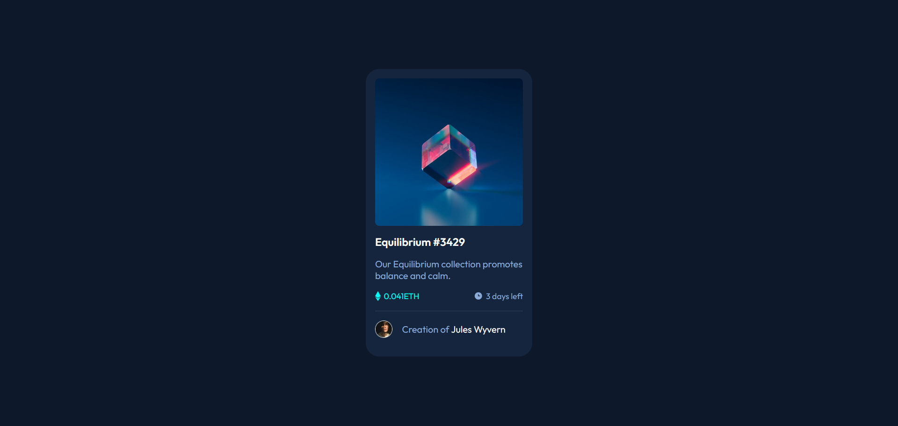
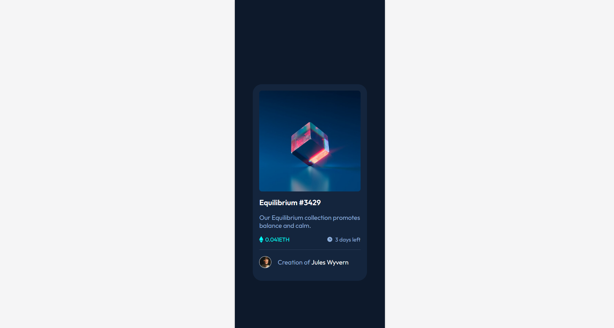

# Frontend Mentor - QR code component solution

This is a solution to the [QR code component challenge on Frontend Mentor](https://www.frontendmentor.io/challenges/qr-code-component-iux_sIO_H). 

## Table of contents

- [Overview](#overview)
  - [Screenshot](#screenshot)
  - [Links](#links)
- [My process](#my-process)
  - [Built with](#built-with)
- [Author](#author)

## Overview

### Screenshot
**Desktop Preview**

**Mobile Preview**

### Links

- Solution URL: [Github Repo URL](https://github.com/Harry-Crocksick/nft-preview-card)
- Live Site URL: [Deployed site URL](https://marn-nft-preview-card.netlify.app/)

## My process
Crafted with pure HTML and CSS and this challenge freshen up my HTML and CSS skill.
Sorry about naming with classes that I used in this challenge.
I am not good at naming things 😅.

### Built with

- Semantic HTML5 markup
- CSS custom properties
- Mobile-first workflow

## Author

- Social Media - [Marn Tet Zan](https://www.facebook.com/james.christian.3914207)
- Frontend Mentor - [@Harry-Crocksick](https://www.frontendmentor.io/profile/Harry-Crocksick)

